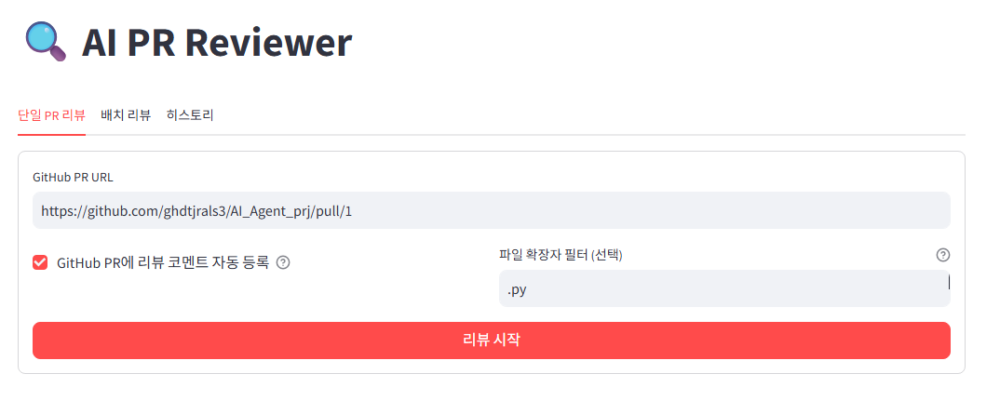
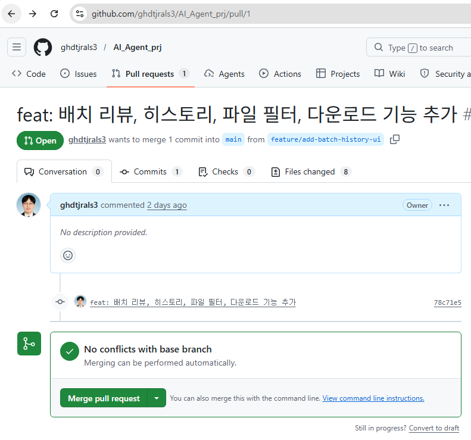
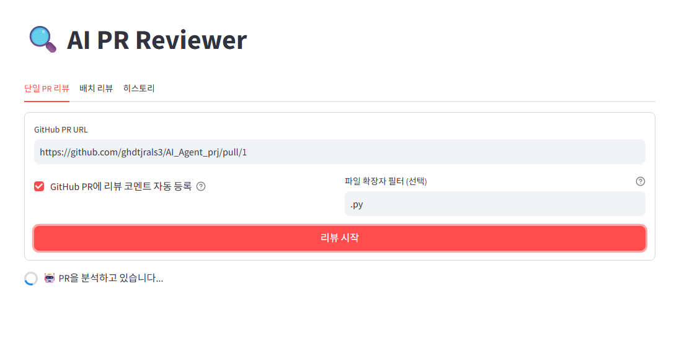
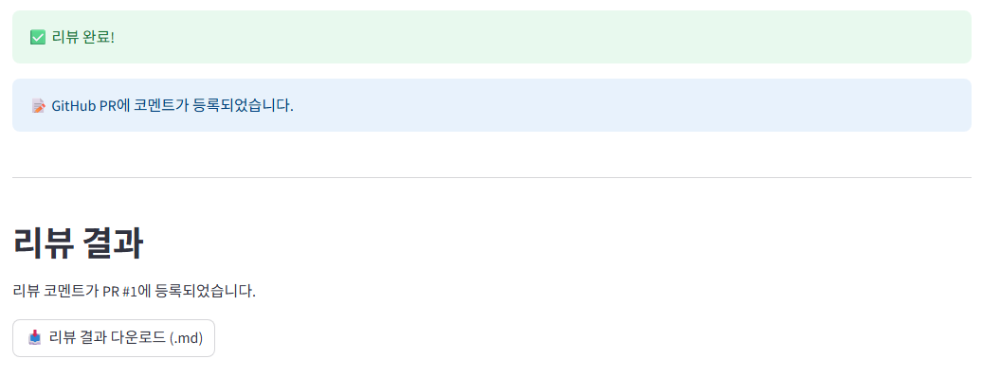
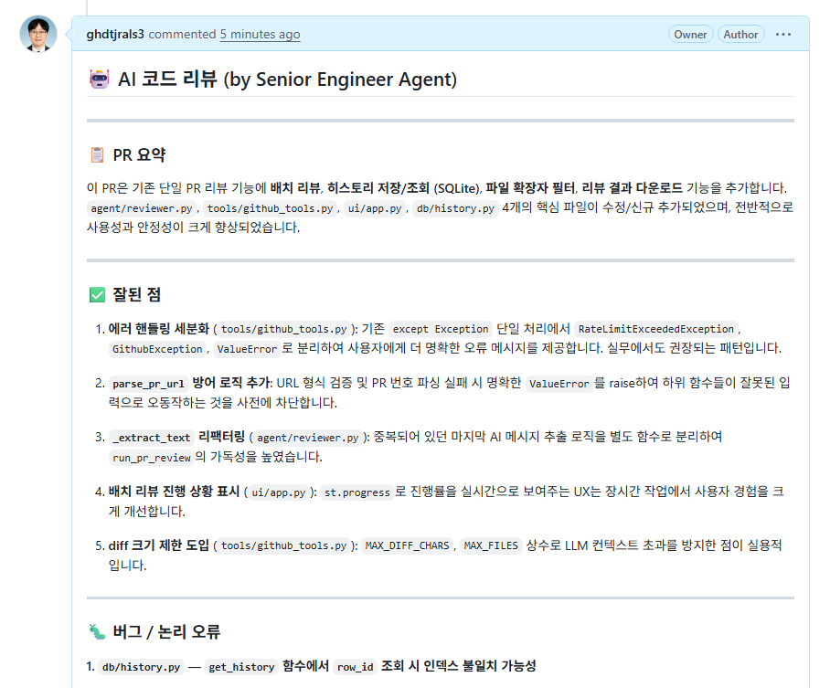
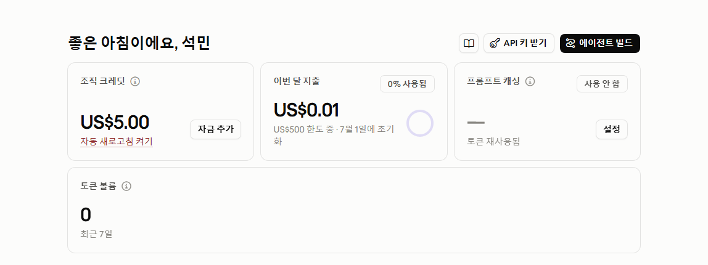
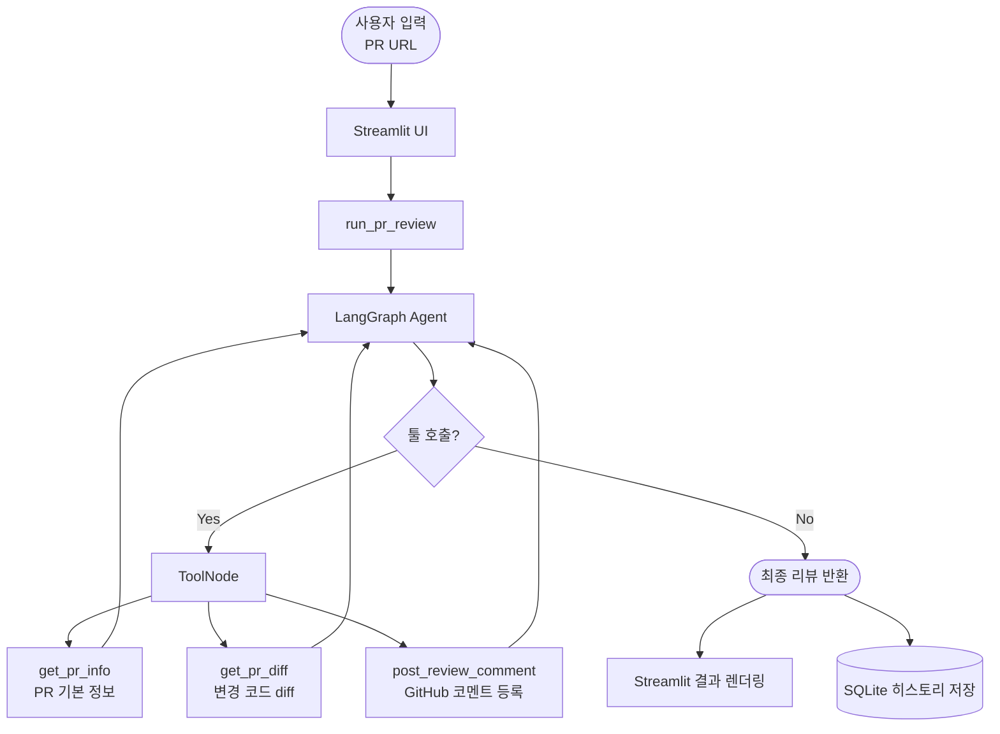

# 🔍 AI PR Reviewer

LangGraph + Claude API로 만든 GitHub PR 자동 코드 리뷰 에이전트 토이 프로젝트

## 실행화면 및 결과

### 1. UI 초기 화면
PR URL 입력, GitHub 자동 등록 여부 선택, `.py`와 같은 파일 확장자 필터 설정 후 리뷰를 시작할 수 있습니다.



### 2. 리뷰 대상 PR 확인
실제 GitHub PR 페이지에서 리뷰할 PR URL을 확인합니다. 8개 파일이 변경된 `feature/add-batch-history-ui` 브랜치의 PR입니다.



### 3. LangGraph 에이전트 분석 중
리뷰 시작 버튼을 누르면 LangGraph 에이전트가 GitHub API를 호출해 PR 정보와 diff를 수집하고 Claude가 분석을 진행합니다.



### 4. 리뷰 완료 및 결과 다운로드
분석이 완료되면 GitHub PR에 코멘트가 자동 등록되고, 리뷰 결과를 `.md` 파일로 다운로드할 수 있습니다.



### 5. GitHub PR에 자동 등록된 리뷰 코멘트
Claude가 작성한 리뷰가 PR 요약, 잘된 점, 버그, 코드 품질, 보안, 성능, 총평 구조로 GitHub PR 코멘트에 직접 등록됩니다.



### 6. Anthropic Console — Claude API 실제 사용 확인
Anthropic Console에서 이번 달 API 사용량($0.01)을 확인할 수 있으며, Claude API가 실제로 호출되었음을 증명합니다.



## 주요 기능

- 🤖 **AI 코드 리뷰** — 버그, 코드 품질, 보안, 성능 4가지 관점 분석
- 📦 **배치 리뷰** — 여러 PR을 한 번에 처리
- 🔍 **파일 필터** — 특정 확장자만 선택적으로 리뷰
- 📥 **결과 다운로드** — 마크다운 파일로 저장
- 🗂️ **히스토리** — SQLite 기반 리뷰 이력 관리
- 💬 **GitHub 연동** — 리뷰 결과를 PR 코멘트로 자동 등록

## 아키텍처

### LangGraph 에이전트 플로우



### 프로젝트 구조

```
pr-reviewer/
├── agent/
│   └── reviewer.py       ← LangGraph 에이전트 (단일/배치 리뷰)
├── tools/
│   └── github_tools.py   ← GitHub API 툴 3개
├── db/
│   └── history.py        ← SQLite 히스토리 CRUD
├── ui/
│   └── app.py            ← Streamlit UI (단일/배치/히스토리 탭)
├── Dockerfile
├── docker-compose.yml
└── requirements.txt
```

## 시작하기

### 1. 환경변수 설정

```bash
cp .env.example .env
# .env 파일에 API 키 입력
```

### 2. 도커로 실행

```bash
docker-compose up --build
```

### 3. 브라우저에서 접속

```
http://localhost:8501
```

## 환경변수

| 변수 | 설명 |
|---|---|
| `ANTHROPIC_API_KEY` | Anthropic API 키 |
| `GITHUB_TOKEN` | GitHub Personal Access Token (`repo` 권한 필요) |

## 리뷰 항목

| 항목 | 설명 |
|---|---|
| 📋 PR 요약 | PR이 무엇을 하는지 요약 |
| ✅ 잘된 점 | 코드의 긍정적인 부분 |
| 🐛 버그 / 논리 오류 | Null 처리, 엣지 케이스, 잘못된 로직 |
| 🔧 코드 품질 | 가독성, 중복, 더 나은 패턴 제안 |
| 🔒 보안 취약점 | 심각도별 보안 이슈 |
| 🚀 성능 | N+1 쿼리, 메모리 낭비 등 |
| 💬 총평 | Approve / Request Changes 권고 |

## LangGraph 핵심 메소드 정리

이 프로젝트에서 사용한 LangGraph API를 코드 흐름 순서대로 정리합니다.

### 1. 상태(State) 정의

```python
from typing import Annotated
from typing_extensions import TypedDict
from langgraph.graph.message import add_messages

class AgentState(TypedDict):
    messages: Annotated[list[BaseMessage], add_messages]
    pr_url: str
    post_to_github: bool
```

| 요소 | 설명 |
|------|------|
| `TypedDict` | 그래프 전체에서 공유되는 상태 스키마 정의 |
| `Annotated[list, add_messages]` | `messages` 필드에 `add_messages` reducer 적용 — 덮어쓰지 않고 **리스트에 누적** |
| `add_messages` | 새 메시지를 기존 리스트에 append하는 내장 reducer. 같은 `id`면 교체, 없으면 추가 |

---

### 2. 그래프 생성 및 노드 등록

```python
from langgraph.graph import StateGraph, END

graph = StateGraph(AgentState)   # 상태 타입을 인자로 받아 그래프 초기화
graph.add_node("agent", agent_node)  # 노드 이름 + 실행할 함수 등록
graph.add_node("tools", tool_node)
```

| 메소드 | 설명 |
|--------|------|
| `StateGraph(schema)` | 타입이 지정된 상태 스키마로 그래프 인스턴스 생성 |
| `add_node(name, fn)` | 노드 등록. `fn`은 `state -> dict` 시그니처 (반환값이 상태에 병합됨) |
| `END` | 그래프 종료를 나타내는 특수 상수. 엣지 목적지로 사용 |

---

### 3. 진입점 및 엣지 설정

```python
graph.set_entry_point("agent")                      # 시작 노드 지정
graph.add_conditional_edges("agent", should_continue)  # 조건부 라우팅
graph.add_edge("tools", "agent")                    # 고정 엣지
```

| 메소드 | 설명 |
|--------|------|
| `set_entry_point(node)` | 그래프 실행 시 최초로 진입할 노드 지정 |
| `add_conditional_edges(src, fn)` | `fn(state) -> str`의 반환값(노드 이름 또는 `END`)으로 다음 노드 결정 |
| `add_edge(src, dst)` | 항상 같은 노드로 이동하는 고정 엣지 |

> **이 프로젝트의 라우팅 로직**: `should_continue`가 마지막 메시지에 `tool_calls`가 있으면 `"tools"`, 없으면 `END` 반환

---

### 4. 그래프 컴파일 및 실행

```python
app = graph.compile()          # 그래프를 실행 가능한 Runnable로 컴파일
final_state = app.invoke(initial_state)  # 동기 실행, 최종 상태 반환
```

| 메소드 | 설명 |
|--------|------|
| `compile()` | 엣지·노드 유효성 검증 후 실행 가능한 객체(CompiledGraph) 반환 |
| `invoke(state)` | 동기 실행. 그래프가 `END`에 도달할 때까지 노드를 순차 실행하고 최종 상태 반환 |

---

### 5. ToolNode (prebuilt)

```python
from langgraph.prebuilt import ToolNode

tool_node = ToolNode(TOOLS)
```

| 요소 | 설명 |
|------|------|
| `ToolNode(tools)` | `@tool` 데코레이터가 붙은 함수 목록을 받아 자동으로 도구를 실행하는 노드 생성 |
| 내부 동작 | 마지막 AI 메시지의 `tool_calls`를 읽어 해당 툴을 호출하고, 결과를 `ToolMessage`로 state에 추가 |

---

### 전체 그래프 흐름 요약

```
invoke(state)
    │
    ▼
[agent 노드] ──── tool_calls 있음 ────▶ [tools 노드]
    ▲                                        │
    └────────────────────────────────────────┘
    │
tool_calls 없음
    │
    ▼
  END
```

## 기술 스택

| 역할 | 기술 |
|---|---|
| 에이전트 워크플로우 | LangGraph 0.2.56 |
| LLM | Claude claude-sonnet-4-6 (langchain-anthropic 0.3.0) |
| GitHub API | PyGithub 2.5.0 |
| 웹 UI | Streamlit 1.41.1 |
| 히스토리 저장 | SQLite (내장) |
| 컨테이너 | Docker / docker-compose |
